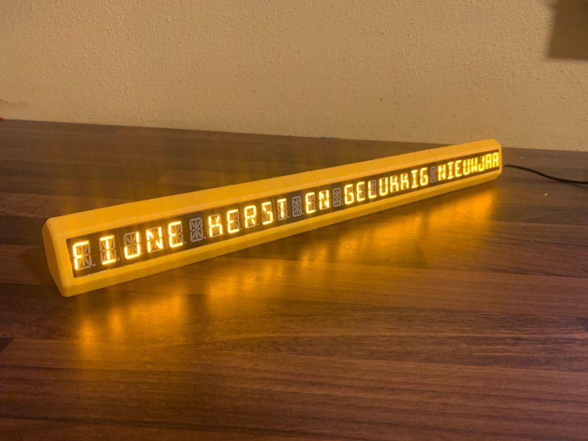

# hexline

A marquee of 32 16-segment characters.

> [!NOTE]  
> This project is a remix of the [hexboard](https://github.com/brainsmoke/hexboard) project by [brainsmoke](https://github.com/brainsmoke). Take a look to see what the project was originally designed to do, it's awesome.



# Usage

> [!WARNING]  
> This firmware works (on `main`) but is in flux. I still want to add various other features and such.

Build and flash the firmware onto a Pi Pico. Connect the UART from the PCB to pin 4 on your Pi Pico. Make sure to tie SWDIO from the PCB to ground. When you plug in the Pi Pico to USB a new `/dev/ttyACMx` will appear. You can connect to it with your favorite serial emulator at 115200 baud; for example `screen /dev/ttyACM0 115200`.

You can then type and letters will appear. `\r` clears the screen.

# Components

## Software

This repository is also a Go package that can interface with the firmware provided in the same repository. If you want to run directly from source checkout:

```
€ go run ./main.go display 'some text'
# displays 'some text'
€ go run ./main.go display -d 1000 'some text' 'some other text'
# displays 'some text', waits 1000ms, displays 'some other text'
€ go run ./main.go display < /etc/passwd
# displays the lines from `/etc/passwd` with a wait time of 500ms per line
```

## PCB

You can find the PCB for this at the [original project](https://github.com/brainsmoke/hexboard) in the `pcb/` subdirectory. The PCB contains an STM32 microcontroller that translates data that it receives over UART to the correct driving protocols for each of the segments.

## Firmware

The `hexline-ascii` firmware provides a Serial-over-USB interface that consumes ascii text. The firmware takes care of rendering to the segments for you.

You can run the firmware on a [Raspberry Pi Pico](...) with GPIO 4 connected to the UART on the PCB. If you want to fiddle with the firmware you can open their containing directories with the [Pico SDK](https://github.com/raspberrypi/pico-sdk) somewhere in your environment.

## Housing

You can find STLs in the [./hardware/housing](./hardware/housing) directory. These can be printed at home. You have to print one of each with the except ion of `left.stl` and `right.stl` which both have to be printed twice.

The alignment pins fit loosely on purpose; you can wrap them with some paper to make them tight fitting. When fitting the midsection you need to pull it apart a bit to slide it over the bottom header on the PCB, be careful not to bend any pins.

The right endcap contains room for a USB-C breakout board which you can then solder onto your preferred USB connection internally.
